# Promise

The Promise object represents the eventual completion (or failure) of an asynchronous operation and its resulting value. 

A Promise is a proxy for a value not necessarily known when the promise is created. It allows you to associate handlers with an asynchronous action's eventual success value or failure reason. This lets asynchronous methods return values like synchronous methods: instead of immediately returning the final value, the asynchronous method returns a promise to supply the value at some point in the future.

A Promise is in one of these states:
* **pending:** initial state, neither fulfilled nor rejected.
* **fulfilled:** meaning that the operation was completed successfully.
* **rejected:** meaning that the operation failed.

The eventual state of a pending promise can either be fulfilled with a value or rejected with a reason (error). When either of these options occur, the associated handlers queued up by a promise's then method are called. If the promise has already been fulfilled or rejected when a corresponding handler is attached, the handler will be called, so there is no race condition between an asynchronous operation completing and its handlers being attached.

A promise is said to be settled if it is either fulfilled or rejected, but not pending.


Promise itself has no first-class protocol for cancellation, but you may be able to directly cancel the underlying asynchronous operation, typically using AbortController.

## Chained Promises

The promise methods `then()`, `catch()`, and `finally()` are used to associate further action with a promise that becomes settled. 

The `then()` method takes up to two arguments; the first argument is a callback function for the fulfilled case of the promise, and the second argument is a callback function for the rejected case. The `catch()` and `finally()` methods call `then()` internally and make error handling less verbose. For example, a `catch()` is really just a `then()` without passing the fulfillment handler.

As these methods return promises, they can be chained. For example:

```javascript
const cart = ['shoes', 'kurta', 'pants'];
```

Operations are asynschronous.
Traditionsally coding with callbacks, `createOrder` function(API) takes a cart details and a callback function. `createOrder` generates the orderId and some point of time call the callback function with the orderId. Here, we are giving control to `createOrder` API to call our callback function, giving control to other APIs to call our callback functions are known as inversion of control. `createOrder` API might call it or call it twise, we do not know.

```javascript
createOrder(cart, function (orderId) {
  proceedToPayment(orderId)
})
```

Promise solves this inversion of control problem by chaining the then handler instead of passing the callback to the `createOrder` API, now the `createOrder` API will return a promise, which will include either a orderId (value) or rejection reason, on which we can attach our callback.

### Consuming a Promise

```javascript
const promise = createOrder(cart); 
// {data: undefined}
// evantually {data: orderId}

promise.then(function (orderId) {
  proceedToPayment(orderId)
})
```

Initially Promise will have no data but eventually promise will have data in it. Once promise is filled with data (orderId), the then callback is called automatically with orderId. 

We can see the difference in both the approaches, in traditional approach callback function is passed to `createOrder` function whereas using promise callback functions are attached to the promise's then. Now we have full control over our callback and also have a gurantee that our callback will be called only when promise data is arrived and only once.

```javascript
const GITHUB_API = 'https://api.github.com/users/sumitsah'
const user = fetch(GITHUB_API);
```

Before we get the response from fetch:


After we get the response from fetch:

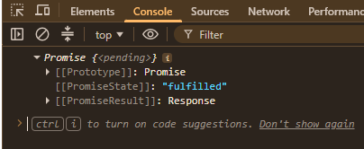

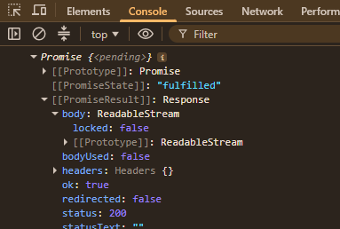

here Response is the readable stream

Promise is immutable, we can utilize the promise data to pass anywhere without worrying about that someone will mutate the data.

Let's say we have the following code for order flow:

```javascript
createOrder(cart, function (orderId) {
  proceedToPayment(orderId, function (paymentInfo) {
    showOrderSummary(paymentInfo, function () {
      updateWalletBalance();
    })
  })
})
```

Here our code is growing horizontally, instead of vertically. which is a callback hell or Pyramid of doom. promise can solve this problem using promise chainig.

The way we handle callbacks in promises is attaching callbacks to the then method. The following way of writing code is promise chaining.

```javascript
createOrder(cart)
.then(function (orderId) {
  proceedToPayment(orderId)
})
.then(function (paymentInfo) {
  showOrderSummary(paymentInfo)
})
.then(function () {
  updateWalletBalance()
})
```

One thing we should notice in above then chaining is that data should be flown from one then to another then. Passing data througout the chain is neccessary.

```javascript
createOrder(cart)
.then(function (orderId) {
  return proceedToPayment(orderId)
})
.then(function (paymentInfo) {
  return showOrderSummary(paymentInfo)
})
.then(function () {
  return updateWalletBalance()
})
```

Similar thing can be achieved by writing callbacks as arrow functions.

```javascript
createOrder(cart)
.then((orderId) => proceedToPayment(orderId))
.then((paymentInfo) => showOrderSummary(paymentInfo))
.then(() => updateWalletBalance())
```

## Quick Recap :
* Promise is not cancleable.
* Promise gives gurantee in whole transcation and can only be resolved once.
* Promise can have three state namely : Pending, Fulfilled and Rejected.
* Promise is immutable.
* Promise chaining solves the issue of callback hell.
* Promise needs to be returned in the promise chain down to the next then.

### Creating a Promise
We have seen previously that creatOrder returns us promise with orderId as data result. We can implement our
createOrder function which will return the orderId wrapping up in a promise object.

```javascript
const cart = ['shoes', 'kurta', 'pants'];
const promise = createOrder(cart);

promise.then(function (orderId) {
    proceedToPayment(orderId)
})

function createOrder(cart) {
    const pr = new Promise(function (resolve, reject) {
        // createOrder, Validate Cart, orderId
        if (!validateCart(cart)) {
            const err = new Error('Cart is not valid')
            reject(err);
        }
        // Logic for create order
        const orderId = '12345';
        if (orderId) {
            resolve(orderId)
        }
    })

    return pr;
}

function validateCart(cart) {
    return true;
}
```

Create a promise using Promise constructor, pass a function in Promise constructor. function will take two 
arguments resolve and reject. Resolve and Reject are function, which are given by the javascript to build promises. It is not something which we pass in, it is given by javascript by the design of Promise API. Resolve will give 
us orderId and reject will throw an error saying that cart is not valid. We need to handle the error by attaching
failure callback to catch function. Now we are gracefully handling the promise failure.

```javascript
createOrder(cart)
    .then(function (orderId) {
        return orderId;
    }).catch(function (err) {
        console.log(err)
    })
```

We can also write in this way

```javascript
createOrder(cart)
    .then(function (orderId) {
        return orderId;
    }).then(function (orderId) {
        return proceedToPayment(orderId);
    }).then(function (paymentInfo) {
        return paymentInfo;
    }).catch(function (err) {
        console.log(err)
    })
```

catch will handle any error which is in the chain in any level. Now let's say our cart is not valid, In this
case, we will get direct error in the catch but we would not be knowing which then chain has failed 
in real life scenario where we have 20 then chains. So we can put the catch top of the chain. By putting the
catch top of the chain (after erroronus then) then subsequent 'then' will proceed.      

```javascript
createOrder(cart)
    .then(function (orderId) {
        return orderId;
    }).catch(function (err) {
        console.log(err)
    }).then(function (orderId) {
        return proceedToPayment(orderId);
    }).then(function (paymentInfo) {
        return paymentInfo;
    })

createOrder(cart)
    .then(function (orderId) {
        return orderId;
    }).then(function (orderId) {
        return proceedToPayment(orderId);
    }).then(function (paymentInfo) {
        return paymentInfo;
    }).catch(function (err) {
        console.log(err)
    }).then(function () {
        console.log('no matter what happens, I will defenitely will called!')
    })
  ```

## Promise static API
### Promise.all()
---
Use Case : To make simultaneous API call (multiple api call at the same time).
Takes an iterable of promises as input and returns a single Promise. This returned promise fulfills when all of the input's promises fulfill (including when an empty iterable is passed), with an array of the fulfillment values. It rejects when any of the input's promises reject, with this first rejection reason.

In a nutshell, Promise.all() takes array of promises and returns array of fulfillment values in a promise
if all the input promises fulfills. But as soon as any of the input promises reject, it rejects with the first
rejected reason that means returned promise will contain an error with a reason.

#### Promise.all() fulfills
---

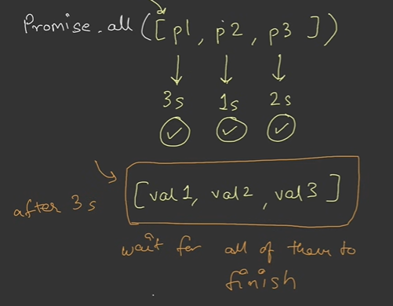


```javascript
const p1 = new Promise((resolve, reject) => {
    setTimeout(() => resolve('P1 Successful'), 3000)
})
const p2 = new Promise((resolve, reject) => {
    setTimeout(() => resolve('P2 Successful'), 1000)
})
const p3 = new Promise((resolve, reject) => {
    setTimeout(() => resolve('P3 Successful'), 2000)
})

console.log(Promise.all([p1, p2, p3]))

Promise.all([p1, p2, p3]).then(res => {
    console.log(res)
})
```
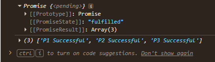


In the above image, we will get the array of fulfillment values after 3 seconds because Promise.all() will wait
for all of them to finish.

#### Promise.all() Rejects
---
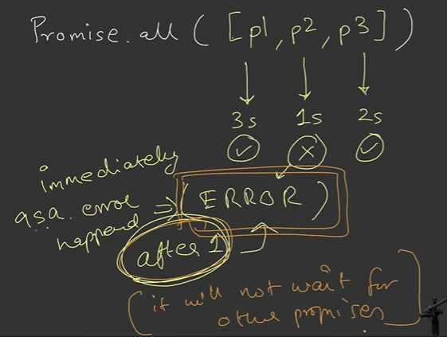

```javascript
const p1 = new Promise((resolve, reject) => {
    setTimeout(() => resolve('P1 Successful'), 3000)
})
const p2 = new Promise((resolve, reject) => {
    setTimeout(() => reject('P2 Fail'), 1000)
})
const p3 = new Promise((resolve, reject) => {
    setTimeout(() => resolve('P3 Successful'), 2000)
})

console.log(Promise.all([p1, p2, p3]))

Promise.all([p1, p2, p3]).then(res => {
    console.log(res)
}).catch((err) => console.log(err))
```
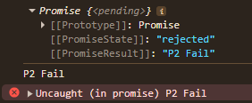

But if p2 fails in 1s, the returned promise will be rejectd immediatly after 1s and
it will not wait for all promises to be fullfilled. So what will happen to P1 and P3, API call is already done.
So when promises are created/executed, you can not cancel the promise in-between. It is kind of all or none.


### Promise.allSettled()
---
Takes an iterable of promises as input and returns a single Promise. This returned promise fulfills when all of the input's promises settle (including when an empty iterable is passed), with an array of objects that describe the outcome of each promise.

#### Promise.allSettled() Fulfilled
---
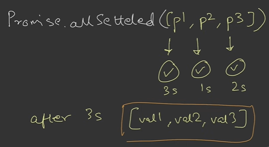

```javascript
const p1 = new Promise((resolve, reject) => {
    setTimeout(() => resolve('P1 Successful'), 3000)
})
const p2 = new Promise((resolve, reject) => {
    setTimeout(() => resolve('P2 Successful'), 1000)
})
const p3 = new Promise((resolve, reject) => {
    setTimeout(() => resolve('P3 Successful'), 2000)
})

console.log(Promise.allSettled([p1, p2, p3]))

Promise.allSettled([p1, p2, p3]).then(res => {
    console.log(res)
}).catch((err) => console.log(err))
```
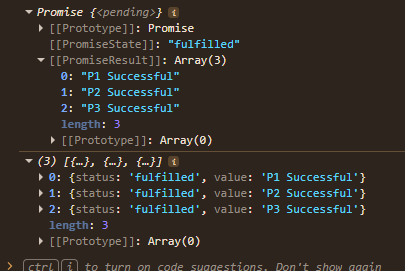

In the above image, we will get the array of objects that describe the outcome of each promise, if all of the
input promises settle.

#### Promise.allSettled() Failure
---
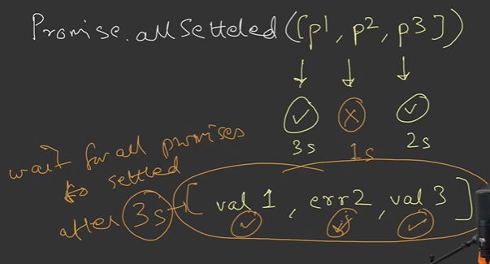
```javascript
const p1 = new Promise((resolve, reject) => {
    setTimeout(() => resolve('P1 Successful'), 3000)
})
const p2 = new Promise((resolve, reject) => {
    setTimeout(() => reject('P2 Fail'), 1000)
})
const p3 = new Promise((resolve, reject) => {
    setTimeout(() => resolve('P3 Successful'), 2000)
})

console.log(Promise.all([p1, p2, p3]))

Promise.allSettled([p1, p2, p3]).then(res => {
    console.log(res)
}).catch((err) => console.log(err))
```

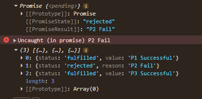

But if P2 fails, Promise.allSettled() will wait for all of them to be settled. After 3 seconds, it will give
you array of objects irrespective of the fullfil or reject (that means settle)

### Promise.race()
--- 
Takes an iterable of promises as input and returns a single Promise.
This returned promise settles with the eventual state (fulfill or reject) of the first input promise that settles.

#### Promise.race() settled with fulfilled
---
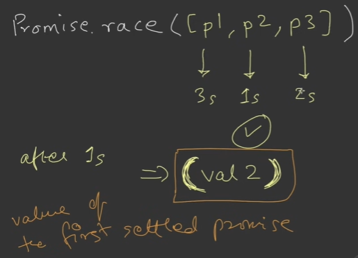

```javascript
const p1 = new Promise((resolve, reject) => {
    setTimeout(() => resolve('P1 Successful'), 3000)
})
const p2 = new Promise((resolve, reject) => {
    setTimeout(() => resolve('P2 Successful'), 1000)
})
const p3 = new Promise((resolve, reject) => {
    setTimeout(() => resolve('P3 Successful'), 2000)
})

console.log(Promise.all([p1, p2, p3]))

Promise.race([p1, p2, p3]).then(res => {
    console.log(res)
}).catch((err) => console.log(err))
```

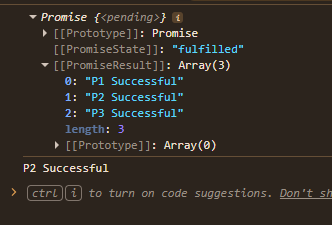


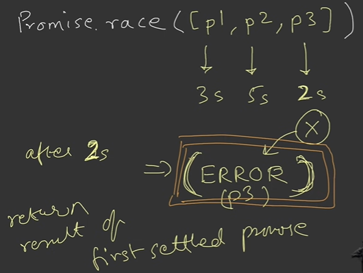

#### Promise.race() settled with reject
---
```javascript
const p1 = new Promise((resolve, reject) => {
    setTimeout(() => resolve('P1 Successful'), 3000)
})
const p2 = new Promise((resolve, reject) => {
    setTimeout(() => reject('P2 fail'), 1000)
})
const p3 = new Promise((resolve, reject) => {
    setTimeout(() => resolve('P3 Successful'), 2000)
})

console.log(Promise.all([p1, p2, p3]))

Promise.race([p1, p2, p3]).then(res => {
    console.log(res)
}).catch((err) => console.log(err))
```
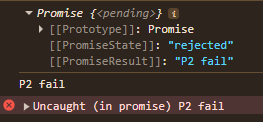

P2 will be settled after 1 second and will return value or reject reason of P2. It will not wait for other promises.

#### Promise.any()
---  
Takes an iterable of promises as input and returns a single Promise. This returned promise fulfills when any of the input's promises fulfill, with this first fulfillment value. It rejects when all of the input's promises reject (including when an empty iterable is passed), with an AggregateError containing an array of rejection reasons.

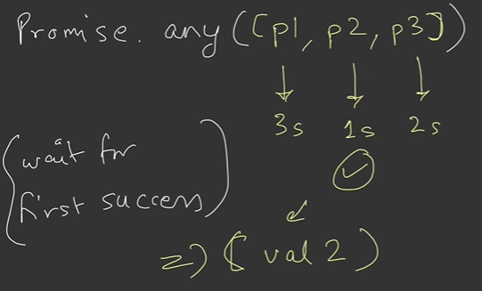

#### Promise.any() fulfills
---
```javascript
const p1 = new Promise((resolve, reject) => {
    setTimeout(() => resolve('P1 Successful'), 3000)
})
const p2 = new Promise((resolve, reject) => {
    setTimeout(() => resolve('P2 Successful'), 1000)
})
const p3 = new Promise((resolve, reject) => {
    setTimeout(() => resolve('P3 Successful'), 2000)
})

console.log(Promise.all([p1, p2, p3]))

Promise.any([p1, p2, p3]).then(res => {
    console.log(res)
}).catch((err) => console.log(err))
```
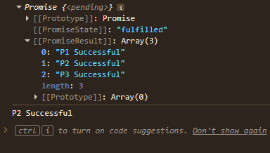

#### Promise.any() fulfills
---
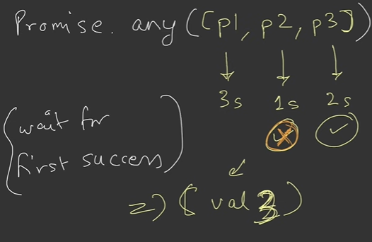

```javascript
const p1 = new Promise((resolve, reject) => {
    setTimeout(() => resolve('P1 Successful'), 3000)
})
const p2 = new Promise((resolve, reject) => {
    setTimeout(() => reject('P2 Fail'), 1000)
})
const p3 = new Promise((resolve, reject) => {
    setTimeout(() => resolve('P3 Successful'), 2000)
})

console.log(Promise.all([p1, p2, p3]))

Promise.any([p1, p2, p3]).then(res => {
    console.log(res)
}).catch((err) => console.log(err))
```
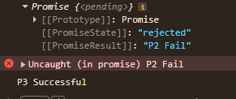

#### Promise.any() rejects
---
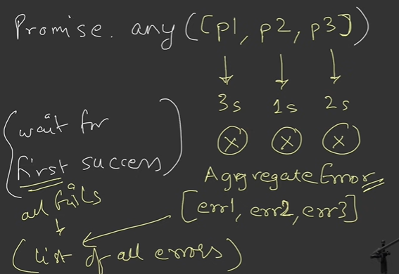

```javascript
const p1 = new Promise((resolve, reject) => {
    setTimeout(() => reject('P1 Fail'), 3000)
})
const p2 = new Promise((resolve, reject) => {
    setTimeout(() => reject('P2 Fail'), 1000)
})
const p3 = new Promise((resolve, reject) => {
    setTimeout(() => reject('P3 Fail'), 2000)
})

console.log(Promise.all([p1, p2, p3]))

Promise.any([p1, p2, p3]).then(res => {
    console.log(res)
}).catch((err) => {
    console.log(err)
    console.log(err.errors)
})
```
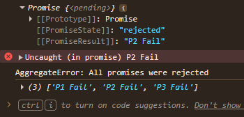

If P2 fulfills after 1 seconds, the P2 value will be returned. Promise.any() wait for first input promise to be fulfilled.
What if P2 gets rejected, again Promise.any() will wait for first promise to be fulfilled(resolve or success).
It's a kind of success seeking race.
If all of them failed, then the returned result will be an Aggregate Error containing an array of rejection reason.

#### Lingos in Promise world
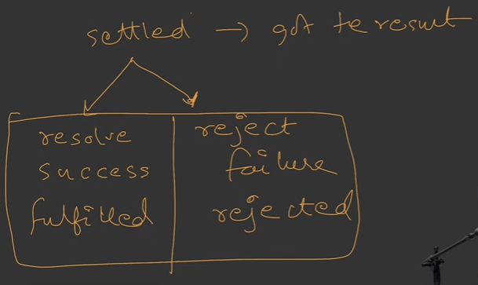